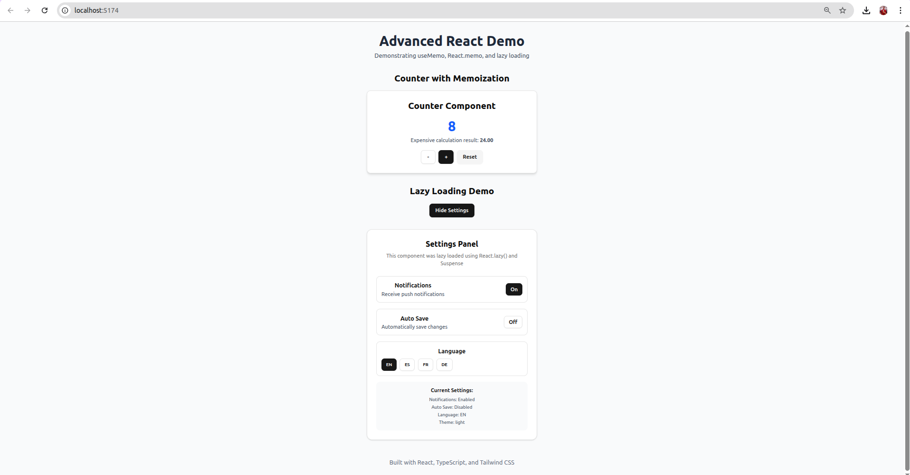
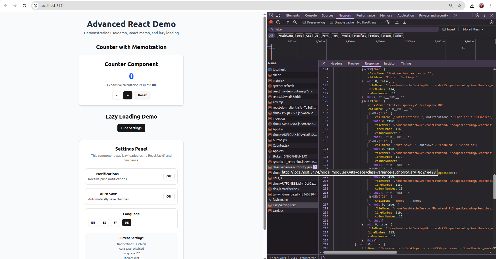
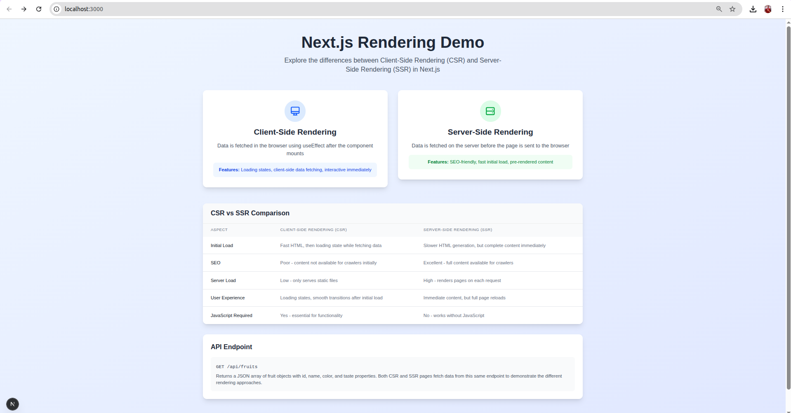
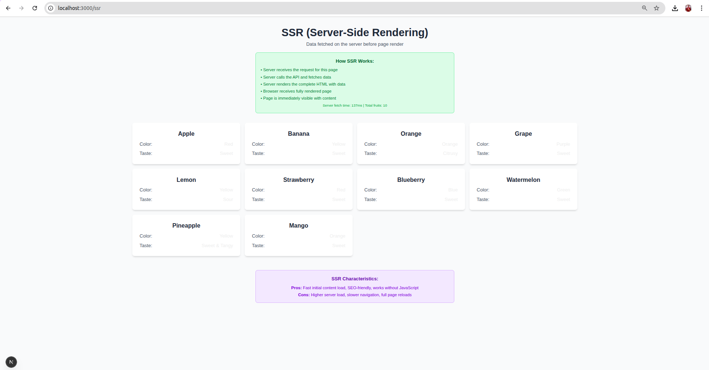
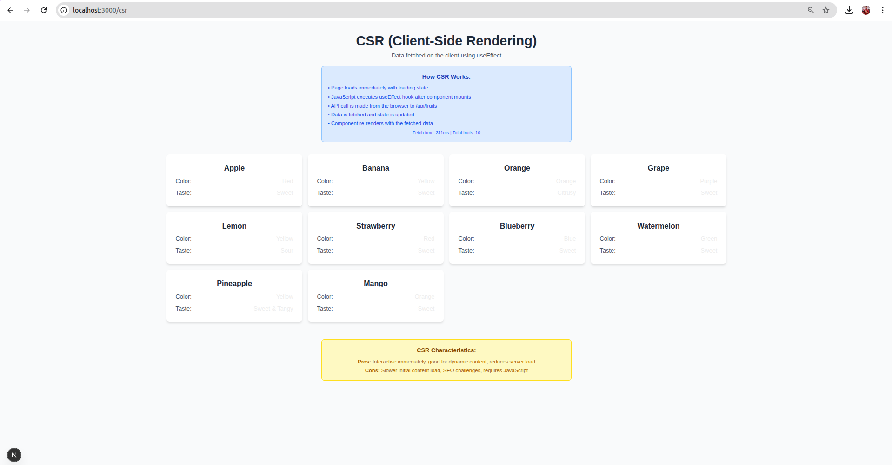

# 🚀 Day 4 Assignment: Advanced React & Next.js Development

This project demonstrates advanced concepts of React and Next.js development using TypeScript. It focuses on building high-performance, maintainable frontend applications with best practices such as component optimization, lazy loading, API integration, rendering strategies (CSR vs SSR), automated testing, and code quality tools.

The assignment is divided into two major parts:

1. **React App:** Emphasizes component performance, lazy loading, and testability.
2. **Next.js App:** Demonstrates API routes, and rendering strategies using both Client-Side Rendering (CSR) and Server-Side Rendering (SSR).

---

## 🎯 Project Goals

- Build performant React components using `React.memo` and `useMemo`
- Implement lazy-loaded components with `React.lazy` and `Suspense`
- Create and consume custom API routes in Next.js
- Learn and compare CSR vs SSR with practical use cases
- Write automated tests using React Testing Library
- Maintain code quality using ESLint and Prettier

---

## 📁 Project Structure Overview

```
Day-4/
│
├── react-advanced-Demo/
│ ├── react-advanced-demo/ → React app: Counter, Lazy Loading, Testing
│ └── next-rendering-demo/ → Next.js app: API, CSR, SSR
│
├── Screenshot/ → Images for demo/screenshots
│ ├── Image-1.png ... Image-5.png
│
├── assignment-summary.md → Summary of objectives and implementation
└── README.md → This documentation
```


---

## ⚛️ React App (`react-advanced-demo`)

### 🔧 What It Does

A React application built with TypeScript showcasing:

- **Counter Component**
  - Implements `useMemo` for expensive calculation optimization
  - Uses `React.memo` to prevent unnecessary re-rendering

- **Lazy Loaded Component**
  - A `Settings` component is loaded on-demand using `React.lazy` and wrapped in `Suspense`
  - A button click triggers the loading of this component

- **Testing**
  - Two test cases written using **React Testing Library (RTL)**:
    - Counter increments correctly
    - Lazy-loaded component appears on button click

- **Linting & Formatting**
  - ESLint and Prettier are configured for consistent code formatting and error detection
  - `npm run lint` and `npm run format` scripts are added

### 🖼️ Screenshots

| Feature             | Screenshot                     |
|---------------------|--------------------------------|
| Counter             |  |
| Lazy Loading        |  |

---

## 🌐 Next.js App (`next-rendering-demo`)

### 🔧 What It Does

A Next.js application built with TypeScript showcasing:

- **API Route**
  - A custom API route at `/api/fruits` returns a list of fruits (JSON array)

- **CSR Page (`pages/csr.tsx`)**
  - Implements Client-Side Rendering using `useEffect` to fetch data from the API after the page loads

- **SSR Page (`pages/ssr.tsx`)**
  - Implements Server-Side Rendering using `getServerSideProps` to fetch data before the page is rendered

- **Comparison**
  - Comments and/or README explanation included to compare CSR and SSR approaches

### ⚖️ CSR vs SSR Comparison

| Feature              | Client-Side Rendering (CSR) | Server-Side Rendering (SSR) |
|----------------------|-----------------------------|-----------------------------|
| Rendered Where       | In Browser                  | On Server                   |
| First Load Speed     | Slower                      | Faster                      |
| SEO Compatibility    | Poor                        | Great                       |
| Use Cases            | Dashboards, Auth Areas      | Blogs, News, SEO Pages      |

### 🖼️ Screenshots

| Page Type | Screenshot |
|-----------|------------|
| Next.js Rendering Demo |  |
| CSR Page  |  |
| SSR Page  |  |

---

## 💻 How to Run the Projects

### ▶️ React App

```bash
cd Day-4/react-advanced-Demo/react-advanced-demo
npm install
```

```bash
npm start
```
##▶️ Next.js App
```bash
cd Day-4/react-advanced-Demo/next-rendering-demo
```
```bash
npm install
```
```bash
npm run dev
```

## 🧼 Linting and Formatting
```bash
npm run lint
```
```bash
npm run format
```


